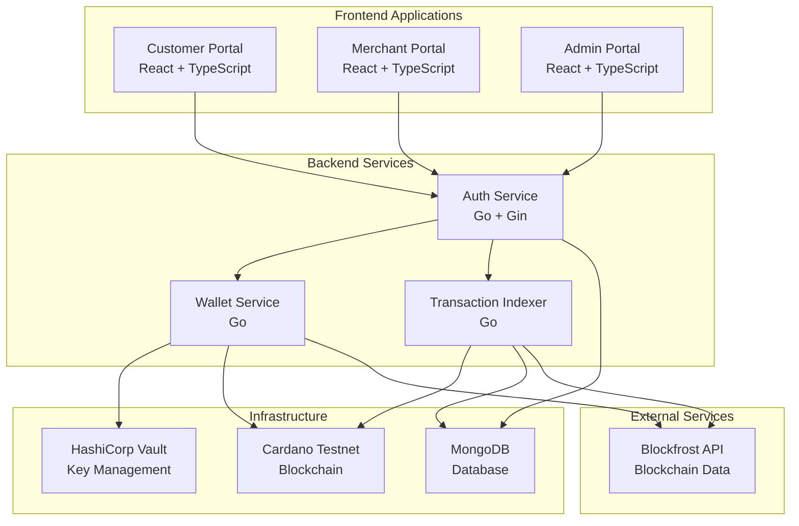

# LoyalCoin 🪙

> **A Cardano Blockchain-Based Loyalty Rewards System for Ethiopia**

[](https://preprod.cardanoscan.io/)
[](LICENSE)
[](https://golang.org/)
[](https://www.typescriptlang.org/)

## 🎯 **Project Overview**

LoyalCoin is a revolutionary blockchain-powered loyalty rewards platform built on Cardano, specifically designed to address the challenges of traditional loyalty programs in emerging markets like Ethiopia. By leveraging Cardano's secure, transparent, and low-cost infrastructure, LoyalCoin creates a seamless ecosystem where merchants can issue digital rewards to customers, who can then redeem them for goods and services.

### **The Problem We Solve**

Traditional loyalty programs face critical challenges:

1. **💸 High Transaction Costs**: Traditional payment processing fees eat into merchant profits
2. **🔒 Lack of Transparency**: Customers don't trust opaque points systems  
3. **📉 Poor Interoperability**: Points locked within single merchants/brands
4. **🌍 Limited Access**: Underbanked populations excluded from digital economies
5. **⚡ Settlement Delays**: Merchants wait days for fund settlements

### **Our Solution**

LoyalCoin provides:

- **✅ Transparent Blockchain Ledger**: All transactions immutably recorded on Cardano
- **✅ Low-Cost Transactions**: Cardano's low fees make micro-rewards economically viable  
- **✅ Instant Settlements**: Real-time on-chain transfers without intermediaries
- **✅ Open Ecosystem**: Customers use rewards across multiple merchants
- **✅ Financial Inclusion**: Accessible to anyone with a smartphone

---

## 📚 **Table of Contents**

- [System Architecture](#-system-architecture)
- [Project Structure](#-project-structure)
- [Portal Applications](#️-portal-applications)
- [Core Features](#-core-features)
- [Economic Model](#-economic-model)
- [API Reference](#-api-reference)
- [Security Architecture](#-security-architecture)
- [Database Schema](#️-database-schema)
- [Prerequisites](#-prerequisites)
- [Getting Started](#-getting-started)
- [System Metrics](#-system-metrics)
- [Impact & Use Cases](#-impact--use-cases)
- [Roadmap](#️-roadmap)
- [Contributing](#-contributing)
- [License](#-license)
- [Support & Community](#-support--community)

---

## 🏗️ **System Architecture**

### **High-Level Architecture**



### **Technology Stack**

| Layer | Technologies |
|-------|-------------|
| **Frontend** | React 18, TypeScript, Vite, TailwindCSS, Zustand, Lucide Icons |
| **Backend** | Go 1.24, Gin Framework, JWT Authentication |
| **Blockchain** | Cardano Preprod Testnet, Lucid Cardano SDK |
| **Database** | MongoDB 7.0 |
| **Security** | HashiCorp Vault, RSA-2048, AES-256, bcrypt |
| **DevOps** | Docker, Docker Compose |

---

## 📁 **Project Structure**

```
LoyalCoin/
├── backend/                      # Go backend services
│   ├── cmd/                      # Application entry points
│   │   ├── auth-service/        # Main API server
│   │   └── create-admin/        # Admin creation CLI tool
│   ├── internal/                # Private application code
│   │   ├── api/                 # HTTP handlers and routes
│   │   ├── auth/                # Authentication logic
│   │   ├── crypto/              # Cardano wallet operations
│   │   ├── database/            # MongoDB layer
│   │   └── vault/               # HashiCorp Vault integration
│   └── go.mod                   # Go dependencies
│
├── loyalcoin-customer-portal/   # Customer web app
│   ├── src/pages/               # React pages (Dashboard, Spend, etc.)
│   ├── src/services/            # API integration
│   └── README.md                # Customer portal docs
│
├── loyalcoin-merchant-portal/   # Merchant web app
│   ├── pages/                   # React pages (Issue, Buy LCN, etc.)
│   ├── services/                # API integration
│   └── README.md                # Merchant portal docs
│
├── loyalcoin-admin-portal/      # Admin web app
│   ├── src/pages/               # React pages (Allocations, Settlements)
│   ├── src/services/            # API integration
│   └── README.md                # Admin portal docs
│
├── docker-compose.yml           # Infrastructure setup
├── README.md                    # This file
└── INSTALLATION.md              # Detailed setup guide
```

---

## 🖥️ **Portal Applications**

LoyalCoin features three specialized web portals, each tailored to its user group:

### **[Customer Portal](loyalcoin-customer-portal/README.md)** 📱
Mobile-first wallet application for end users.
- Receive rewards via QR code
- Spend LCN at merchants
- View transaction history
- **Port:** 3002

### **[Merchant Portal](loyalcoin-merchant-portal/README.md)** 🏪
Business dashboard for managing rewards programs.
- Issue LCN to customers
- Purchase token allocations
- Request settlements
- **Port:** 5173

### **[Admin Portal](loyalcoin-admin-portal/README.md)** 👨‍💼
Administrative interface for platform governance.
- Approve allocation requests
- Process settlements
- Monitor reserve status
- **Port:** 3001

> 📸 **Screenshots and detailed usage guides available in each portal's README**

---

## 🔑 **Core Features**

### **For Customers** 👥

- ✨ **Earn Rewards**: Receive LCN tokens from merchants for purchases/activities
- 💰 **Check Balance**: View LCN balance backed by real Cardano tADA  
- 🔄 **Redeem Rewards**: Spend LCN at any participating merchant
- 📊 **Transaction History**: Complete audit trail of all rewards activity

### **For Merchants** 🏪

- 🛒 **Buy LCN**: Purchase LCN allocations from admin using ETB (local currency)
- 🎁 **Issue Rewards**: Transfer LCN to customer wallets instantly
- 📈 **Analytics Dashboard**: Track rewards issued, redeemed, and customer engagement
- 💸 **Cash Out**: Convert unused LCN back to ETB via settlement requests

### **For Administrators** 👨‍💼

- ✅ **Approve Allocations**: Review and approve merchant LCN purchase requests
- 🏦 **Process Settlements**: Handle merchant cashout requests  
- 📊 **System Monitoring**: View reserve status and transaction volumes
- 🔐 **Governance**: Manage the governance wallet holding platform reserves

---

## 💱 **Economic Model**

### **Conversion Rates**

```
1 tADA = 100 LCN
1 ETB ≈ X LCN (market rate)
```

### **Flow of Value**

```
Merchant Purchasing Flow:
ETB (Fiat) → Admin Wallet → tADA Transfer → Merchant Wallet (as LCN)

Rewards Issuance:
Merchant Wallet (LCN) → Customer Wallet (LCN)

Redemption:
Customer Wallet (LCN) → Merchant Wallet (LCN)

Settlement (Cashout):
Merchant Wallet (tADA) → Admin Wallet → ETB Payout
```

---

## 📡 **API Reference**

### **Base URL**
```
Development: http://localhost:8080/api/v1
Production: https://api.loyalcoin.io/api/v1
```

### **Authentication Endpoints**

#### `POST /auth/signup`
Create a new user account.

**Request:**
```json
{
  "email": "merchant@example.com",
  "password": "SecurePass123!",
  "role": "MERCHANT",
  "business_name": "Coffee Shop"
}
```

**Response:**
```json
{
  "status": "ok",
  "data": {
    "token": "eyJhbGciOiJSUzI1NiIs...",
    "expires_at": "2025-12-06T17:00:00Z",
    "user": {
      "id": "uuid",
      "email": "merchant@example.com",
      "role": "MERCHANT",
      "wallet_address": "addr_test1..."
    }
  }
}
```

#### `POST /auth/login`
Authenticate and receive JWT token.

**Request:**
```json
{
  "email": "merchant@example.com",
  "password": "SecurePass123!"
}
```

---

### **Wallet Endpoints**

#### `GET /wallet/balance`
Get current wallet balance.

**Headers:**
```
Authorization: Bearer <jwt_token>
```

**Response:**
```json
{
  "status": "ok",
  "data": {
    "address": "addr_test1...",
    "ada": 204.5,
    "lovelace": 204500000,
    "lcn": 20450.0,
    "lcn_atomic": 20450
  }
}
```

#### `GET /wallet/transactions`
Retrieve transaction history.

**Query Parameters:**
- `limit`: Number of transactions (max 100)
- `offset`: Pagination offset

---

### **LCN Operations**

#### `POST /lcn/issue` *(Merchant Only)*
Issue LCN rewards to a customer.

**Request:**
```json
{
  "customer_address": "addr_test1...",
  "amount_lcn": 16000,
  "reference": "Purchase #12345"
}
```

**Response:**
```json
{
  "status": "ok",
  "data": {
    "tx_hash": "3061f4c8...",
    "amount_lcn": 16000,
    "remaining_balance": 4450
  }
}
```

#### `POST /lcn/redeem` *(Customer Only)*
Redeem LCN at a merchant.

---

### **Merchant Endpoints**

#### `POST /merchant/allocation/purchase`
Request LCN allocation purchase.

**Request:**
```json
{
  "amount_lcn": 10000,
  "payment_method": "BANK_TRANSFER",
  "payment_reference": "TXN-2025-001"
}
```

#### `POST /merchant/settlement/request`
Request cashout to ETB.

**Request:**
```json
{
  "amount_lcn": 5000,
  "bank_account": {
    "account_number": "1000123456",
    "bank_name": "Commercial Bank of Ethiopia",
    "account_holder": "Coffee Shop Ltd"
  }
}
```

---

### **Admin Endpoints** *(Admin Role Required)*

#### `POST /admin/allocation/approve`
Approve/reject merchant allocation request.

**Request:**
```json
{
  "purchase_id": "uuid",
  "action": "APPROVE",
  "notes": "Payment verified"
}
```

#### `GET /admin/allocation/pending`
List pending allocation requests.

#### `GET /admin/reserve/status`
Check governance wallet reserve status.

---

## 🔐 **Security Architecture**

### **Key Management**

- **Wallet Private Keys**: Encrypted using HashiCorp Vault Transit Engine
- **JWT Keys**: RSA-2048 public/private key pairs
- **Password Hashing**: bcrypt with cost factor 12
- **Transport Security**: HTTPS/TLS in production

### **Authentication & Authorization**

```
User Login → JWT Token Issued → Token Contains:
  - user_id
  - role (CUSTOMER | MERCHANT | ADMIN)
  - wallet_address
  - expiry (24 hours)
```

**Role-Based Access Control (RBAC):**

| Role | Permissions |
|------|------------|
| `CUSTOMER` | View balance, redeem LCN, transaction history |
| `MERCHANT` | Issue LCN, buy allocations, request settlements |
| `ADMIN` | Approve allocations/settlements, view reserves |

---

## 🗄️ **Database Schema**

### **Users Collection**

```typescript
{
  _id: ObjectId,
  email: string,
  password_hash: string,
  role: "CUSTOMER" | "MERCHANT" | "ADMIN",
  business_name?: string, // Merchants only
  wallet: {
    address: string,
    encrypted_private_key: string
  },
  created_at: Date,
  updated_at: Date
}
```

### **Transactions Collection**

```typescript
{
  _id: ObjectId,
  tx_hash: string,
  from_address: string,
  to_address: string,
  amount_lcn: number,
  type: "ISSUANCE" | "REDEMPTION" | "SETTLEMENT",
  status: "PENDING" | "CONFIRMED" | "FAILED",
  submitted_at: Date,
  confirmed_at?: Date,
  block_height?: number
}
```

### **Allocations Collection**

```typescript
{
  _id: ObjectId,
  merchant_id: string,
  amount_lcn: number,
  amount_etb_paid: number,
  payment_method: "BANK_TRANSFER" | "MOBILE_MONEY",
  payment_reference: string,
  status: "PENDING" | "CONFIRMED" | "REJECTED",
  admin_id?: string,
  verified_at?: Date,
  lcn_transfer_tx_hash?: string
}
```

---

## 📋 **Prerequisites**

Before setting up LoyalCoin, ensure you have the following installed:

### **Required Software**

| Requirement | Version | Purpose |
|------------|---------|---------|
| **Go** | 1.24+ | Backend services |
| **Node.js** | 18+ | Frontend applications |
| **npm** | 9+ | Package management |
| **Docker** | 20+ | Infrastructure (MongoDB, Vault) |
| **Docker Compose** | 2.0+ | Multi-container orchestration |

### **External Services**

- **Blockfrost Account**: Free API key from [blockfrost.io](https://blockfrost.io)
- **Cardano Preprod Testnet**: For tADA faucet access

### **Recommended**

- **Git**: For version control
- **VSCode** or **GoLand**: Development environments
- **Postman** or **Thunder Client**: API testing
- **MongoDB Compass**: Database visualization (optional)

---

## 🚀 **Getting Started**

See [INSTALLATION.md](INSTALLATION.md) for detailed setup instructions.

### **Quick Start**

```bash
# Clone repository
git clone https://github.com/yourorg/loyalcoin.git
cd loyalcoin

# Start infrastructure
docker-compose up -d

# Start backend
cd backend
go run ./cmd/auth-service/main.go

# Start frontend (in separate terminals)
cd loyalcoin-merchant-portal && npm run dev
cd loyalcoin-customer-portal && npm run dev
cd loyalcoin-admin-portal && npm run dev
```

---

## 📊 **System Metrics**

- **Transaction Finality**: ~20 seconds (Cardano block time)
- **Transaction Cost**: ~0.17 ADA (~$0.08 USD) per transfer
- **Throughput**: 250 TPS (Cardano network capacity)
- **Wallet Generation**: <1 second
- **API Response Time**: <200ms (p95)

---

## 🌍 **Impact & Use Cases**

### **Real-World Applications**

1. **Retail Loyalty**: Coffee shops, restaurants reward repeat customers
2. **Service Providers**: Salons, gyms offer membership rewards
3. **E-commerce**: Online stores provide cashback in LCN
4. **Community Programs**: NGOs distribute aid via blockchain tokens

### **Key Benefits**

- **Financial Inclusion**: Reaches unbanked populations
- **Reduced Friction**: No intermediaries or high fees
- **Transparency**: All transactions publicly verifiable
- **Programmability**: Smart contract capabilities for future expansion

---

## 🛣️ **Roadmap**

### **Phase 1 (Current)** ✅
- Core wallet and rewards system
- Admin allocation approval
- Settlement processing
- Three web portals

### **Phase 2 (Q1 2026)**
- Mobile applications (iOS/Android)
- QR code payment integration
- Multi-currency support
- Enhanced analytics

### **Phase 3 (Q2 2026)**
- Smart contract automation
- NFT-based loyalty tiers
- Cross-border settlements
- Merchant API SDK

### **Phase 4 (Q3 2026)**
- Cardano mainnet launch
- Decentralized governance
- Token staking rewards
- Partnership integrations

---

## 👥 **Contributing**

We welcome contributions! Please see [CONTRIBUTING.md](CONTRIBUTING.md) for guidelines.

---

## 📄 **License**

This project is licensed under the MIT License - see [LICENSE](LICENSE) for details.

---

## 🤝 **Support & Community**

- **Documentation**: [docs.loyalcoin.io](https://docs.loyalcoin.io)
- **Discord**: [discord.gg/loyalcoin](https://discord.gg/loyalcoin)
- **Email**: support@loyalcoin.io
- **Twitter**: [@LoyalCoinETH](https://twitter.com/loyalcoin)

---

## 🙏 **Acknowledgments**

Built with ❤️ for Ethiopia's digital economy

- **Cardano Foundation** for blockchain infrastructure
- **IOHK** for technical resources
- **Blockfrost** for API services  
- **HashiCorp** for Vault security

---

**Made in Ethiopia 🇪🇹 | Powered by Cardano ₳**
