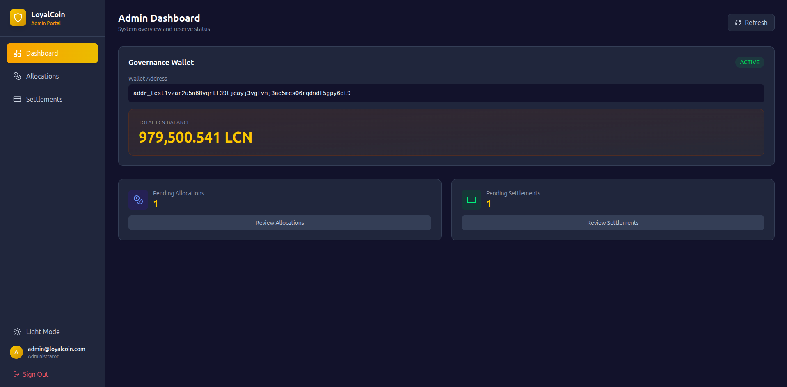
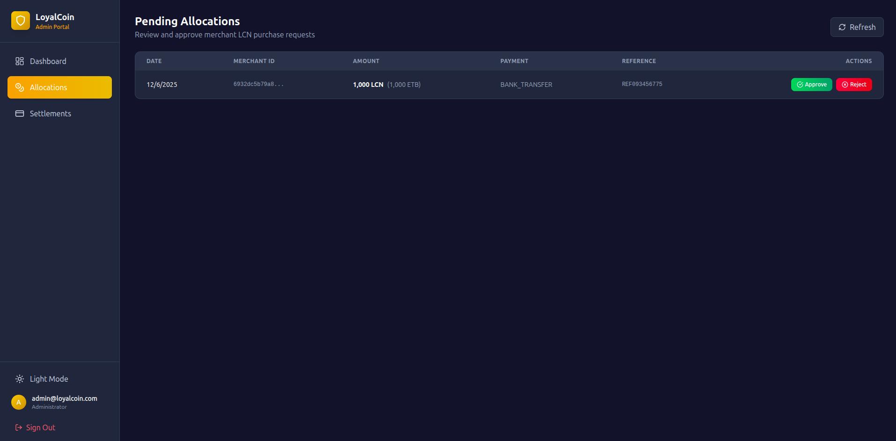
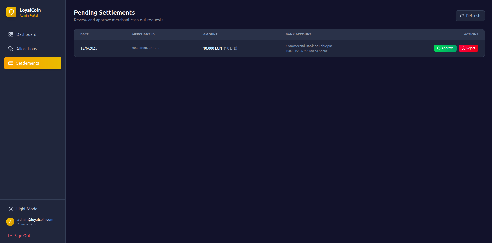

# LoyalCoin Admin Portal

The **LoyalCoin Admin Portal** is a web-based administration interface for managing the LoyalCoin rewards platform. It provides administrators with tools to oversee LCN allocations, handle settlement requests, and monitor the health of the governance reserve.

## Overview

The Admin Portal is built with React and TypeScript, providing a modern, type-safe interface for administrative operations. It communicates with the LoyalCoin backend API to manage:

- **LCN Allocations**: Review and approve merchant requests to purchase LoyalCoin (LCN) tokens
- **Settlement Requests**: Process merchant requests to convert LCN back to Ethiopian Birr (ETB)
- **Reserve Monitoring**: Track the governance wallet balance and system health

## Screenshots

### Dashboard


### Allocations Management


### Settlements Management


## Tech Stack

- **Frontend Framework**: React 18 with TypeScript
- **Build Tool**: Vite
- **Routing**: React Router DOM (HashRouter for electron compatibility)
- **State Management**: Zustand with persist middleware
- **Styling**: TailwindCSS with custom design tokens
- **Charts**: Recharts for data visualization
- **Icons**: Lucide React

## Features

### 🔐 Authentication
- Admin-only access with role-based verification
- JWT token-based authentication
- Persistent sessions with local storage
- Automatic token refresh on page reload


### 📊 Dashboard
- Real-time overview of system metrics
- Governance wallet balance (LCN and lovelace)
- Pending allocations and settlements count
- Visual charts for trends and analytics
- System health monitoring


### 💰 Allocation Management
- View all pending merchant LCN purchase requests
- Approve or reject allocation requests
- Track payment details and merchant information
- Add administrative notes for audit trails


### 🏦 Settlement Management
- Review merchant requests to cash out LCN
- Approve or reject settlements
- Verify bank account details
- Add payment references and notes
- Monitor settlement status


### 🎨 User Experience
- Dark/Light theme toggle
- Responsive design for all screen sizes
- Clean, modern UI with consistent styling
- Real-time data updates

## Prerequisites

- **Node.js**: v16 or higher
- **npm**: v7 or higher (comes with Node.js)
- **LoyalCoin Backend**: Running and accessible

## Installation

1. **Navigate to the admin portal directory:**
   ```bash
   cd loyalcoin-admin-portal
   ```

2. **Install dependencies:**
   ```bash
   npm install
   ```

3. **Configure environment variables:**
   
   Create a `.env` file in the root of the admin portal directory:
   ```env
   VITE_API_URL=http://localhost:8080
   ```
   
   Update `VITE_API_URL` to point to your LoyalCoin backend API endpoint.

## Running the Application

### Development Mode

Start the development server with hot module replacement:

```bash
npm run dev
```

The application will be available at `http://localhost:3001`

### Production Build

Build the application for production:

```bash
npm run build
```

The optimized build will be output to the `dist/` directory.

### Preview Production Build

Preview the production build locally:

```bash
npm run preview
```

## Project Structure

```
loyalcoin-admin-portal/
├── src/
│   ├── components/         # Reusable UI components
│   │   └── Layout.tsx     # Main layout with navigation
│   ├── pages/             # Route-based page components
│   │   ├── Dashboard.tsx  # Main dashboard view
│   │   ├── Login.tsx      # Admin login page
│   │   ├── Allocations.tsx # Allocation management
│   │   └── Settlements.tsx # Settlement management
│   ├── services/          # API service layer
│   │   └── api.ts        # Backend API integration
│   ├── App.tsx           # Main app component with routing
│   ├── store.ts          # Zustand state management
│   ├── main.tsx          # Application entry point
│   └── index.css         # Global styles and Tailwind
├── public/               # Static assets
├── index.html           # HTML template
├── vite.config.ts       # Vite configuration
├── tailwind.config.js   # Tailwind CSS configuration
├── tsconfig.json        # TypeScript configuration
└── package.json         # Project dependencies
```

## Usage Guide

### First-Time Login

1. Navigate to `http://localhost:3001`
2. You'll be redirected to the login page
3. Enter admin credentials created using the backend's `create-admin` command
4. Only users with `ADMIN` role can access the portal

### Creating Admin Accounts

Admin accounts must be created using the backend CLI tool:

```bash
cd ../backend
go run cmd/create-admin/main.go
```

Follow the prompts to create a new admin user.

### Managing Allocations

1. Navigate to **Allocations** from the sidebar
2. View all pending merchant purchase requests
3. Review merchant details, payment information, and requested LCN amount
4. Click **Approve** to process the allocation and transfer LCN to the merchant
5. Click **Reject** to deny the request (add notes for transparency)
6. The backend handles blockchain transactions automatically upon approval

### Managing Settlements

1. Navigate to **Settlements** from the sidebar
2. View all pending merchant settlement requests
3. Review merchant bank account details and LCN amount to be cashed out
4. Click **Approve** to initiate the fiat transfer process
5. Add payment reference (e.g., bank transaction ID) for record-keeping
6. Click **Reject** if the request is invalid (add notes)

### Monitoring System Health

The Dashboard provides real-time metrics:
- **Reserve Balance**: Total LCN available in governance wallet
- **Pending Items**: Number of allocations and settlements awaiting approval
- **Trends**: Visual charts showing system activity over time
- **Health Status**: Overall system health indicator

## API Integration

The admin portal communicates with the backend via REST API:

| Endpoint | Method | Purpose |
|----------|--------|---------|
| `/api/v1/auth/login` | POST | Admin authentication |
| `/api/v1/admin/reserve/status` | GET | Get governance wallet status |
| `/api/v1/admin/allocation/pending` | GET | List pending allocations |
| `/api/v1/admin/allocation/approve` | POST | Approve/reject allocation |
| `/api/v1/admin/settlement/pending` | GET | List pending settlements |
| `/api/v1/admin/settlement/approve` | POST | Approve/reject settlement |

All requests (except login) require a valid JWT token in the `Authorization` header.

## Configuration

### Environment Variables

| Variable | Description | Default |
|----------|-------------|---------|
| `VITE_API_URL` | Backend API base URL | `http://localhost:8080` |

### Port Configuration

The dev server runs on port `3001` by default. To change this, edit `vite.config.ts`:

```typescript
export default defineConfig({
  plugins: [react()],
  server: {
    port: 3001 // Change to your desired port
  }
})
```

## Security Considerations

- **Admin-Only Access**: The portal enforces admin role verification
- **JWT Tokens**: All API requests are authenticated with JWT tokens
- **Token Persistence**: Tokens are stored in localStorage with auto-cleanup on logout
- **HTTPS Required**: In production, always use HTTPS for the admin portal
- **CORS**: Ensure backend CORS settings allow the admin portal origin

## Troubleshooting

### Cannot Login
- Verify the backend is running and accessible
- Check that `VITE_API_URL` points to the correct backend endpoint
- Ensure admin account exists (created via backend CLI)
- Check browser console for API error messages

### API Requests Failing
- Verify JWT token is present in localStorage (`admin_token` key)
- Check network tab for detailed error responses
- Ensure backend API is running and healthy
- Verify CORS configuration allows admin portal origin

### Build Errors
- Delete `node_modules/` and `package-lock.json`, then run `npm install`
- Ensure Node.js version is 16 or higher
- Check TypeScript errors with `npm run build`

## Development

### Code Style
- Follow TypeScript best practices
- Use functional components with hooks
- Implement proper error handling
- Add comments for complex logic

### State Management
The application uses Zustand for state management with the following stores:
- **AuthState**: User authentication and session management
- **ThemeState**: Dark/light mode preferences

### Adding New Features
1. Add type definitions in the relevant service file
2. Create API functions in `src/services/api.ts`
3. Add UI components in `src/components/` or `src/pages/`
4. Update routes in `src/App.tsx` if needed
5. Update state management in `src/store.ts` if required

## Contributing

This is an internal admin tool for the LoyalCoin platform. For contributions:
1. Follow the existing code structure and naming conventions
2. Test all changes thoroughly before deployment
3. Update this README if adding new features or configuration options

## Related Projects

- **LoyalCoin Backend**: Go-based REST API and blockchain integration
- **LoyalCoin Merchant Portal**: Merchant-facing interface for managing rewards
- **LoyalCoin Documentation**: Comprehensive system documentation

## License

See the main LoyalCoin project LICENSE file.

## Support

For issues or questions:
- Check the backend logs for API errors
- Review browser console for frontend errors
- Consult the main LoyalCoin documentation
