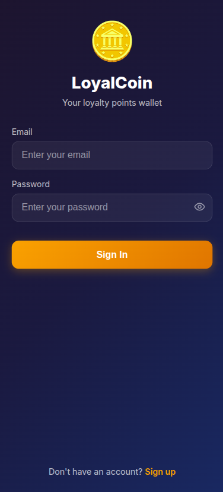
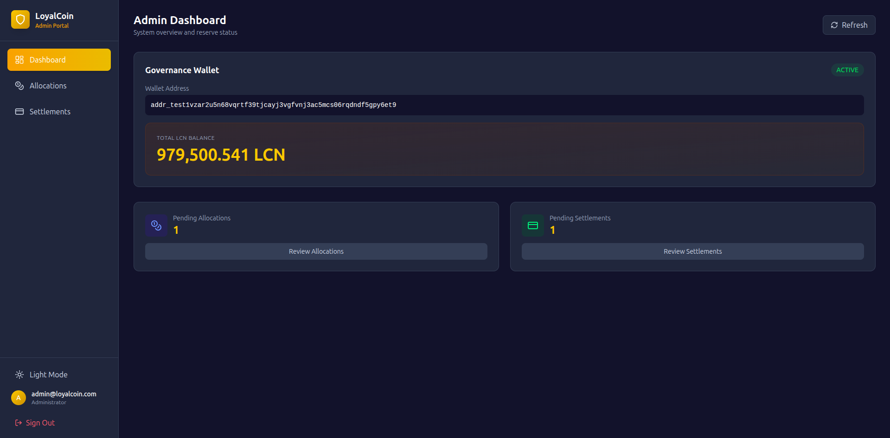
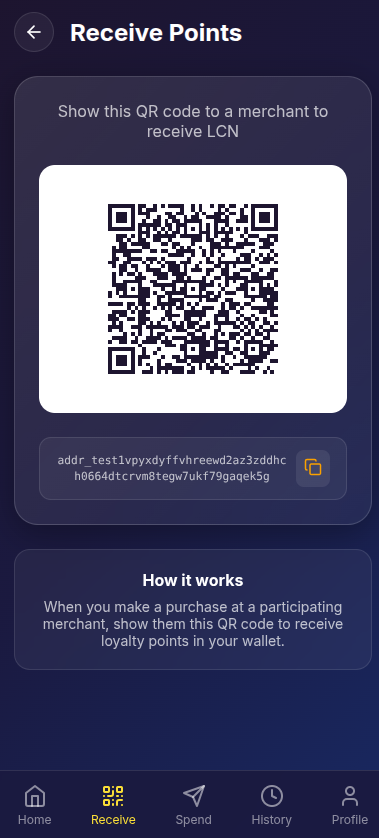
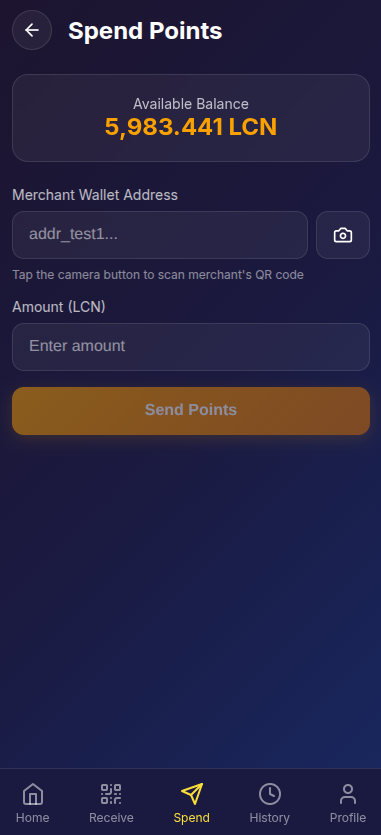
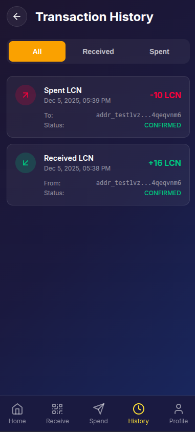
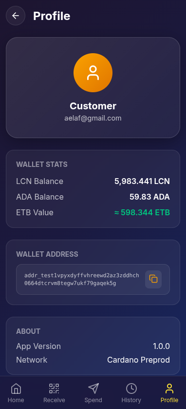

# LoyalCoin Customer Wallet

The **LoyalCoin Customer Wallet** is a mobile-first web application that empowers customers to receive, store, and spend LoyalCoin (LCN) rewards across a network of participating merchants. Built on the Cardano blockchain, it provides a simple, secure, and user-friendly way to participate in the LoyalCoin rewards ecosystem.

## Overview

The Customer Wallet transforms traditional loyalty programs by giving customers complete control over their digital rewards. Unlike conventional reward systems where points are locked to specific businesses, LoyalCoin enables true reward portability—earn rewards from any merchant and spend them anywhere in the network.

**Key Benefits for Customers:**
- **Universal Rewards**: One wallet for all participating merchants
- **True Ownership**: Your rewards are stored on the blockchain, not merchant databases
- **Instant Transfers**: Receive and spend LCN in seconds
- **Cross-Merchant Spending**: Use rewards earned at Store A to shop at Store B
- **Transparent Tracking**: Full transaction history on public blockchain
- **No Intermediaries**: Direct peer-to-peer transactions with merchants

## Screenshots

### Welcome & Authentication

*Simple login and signup with automatic wallet creation*

### Dashboard

*At-a-glance view of your LCN balance and recent activity*

### Receive LCN

*Generate QR code to receive LCN rewards from merchants*

### Spend LCN

*Scan merchant QR codes to redeem rewards for purchases*

### Transaction History

*Complete record of all LCN received and spent*

### Profile & Settings

*Manage your account, view wallet address, and adjust settings*

## Tech Stack

- **Frontend Framework**: React 18 with TypeScript
- **Build Tool**: Vite 5
- **Routing**: React Router DOM v6
- **State Management**: Zustand 4
- **Styling**: Custom CSS with mobile-first responsive design
- **QR Code**: html5-qrcode for scanning, qrcode.react for generation
- **Icons**: Lucide React
- **Blockchain**: Cardano (via backend API)

## Features

### 🔐 Quick & Easy Signup
- **Email Registration**: Simple signup with email and password
- **Automatic Wallet Creation**: Cardano wallet generated instantly on signup
- **No Seed Phrases**: User-friendly approach—wallet managed securely by backend
- **Instant Access**: Start receiving rewards immediately after registration


### 🏠 Dashboard
- **Real-Time Balance**: Current LCN holdings displayed prominently
- **ETB Equivalent**: See your rewards value in Ethiopian Birr
- **Quick Actions**: Fast access to Receive, Spend, and History
- **Recent Activity**: Latest transactions at your fingertips
- **Mobile-Optimized**: Clean, card-based layout for easy navigation
- **Pull-to-Refresh**: Swipe down to update balance and transactions


### 📥 Receive LCN (Earn Rewards)
- **QR Code Display**: Show your wallet QR code to merchants
- **Easy Sharing**: Copy wallet address for online transfers
- **Merchant Scanning**: Merchants scan your code to send rewards instantly
- **Real-Time Notifications**: See balance update when LCN arrives
- **Transaction Details**: View amount, source, and timestamp
- **Multiple Sources**: Receive from any merchant or other customers


### 💸 Spend LCN (Redeem Rewards)
- **QR Code Scanning**: Scan merchant wallet QR codes with your device camera
- **Manual Entry**: Paste merchant address for online redemptions
- **Amount Input**: Specify how much LCN to spend
- **Instant Redemption**: Blockchain transaction submitted immediately
- **Merchant Verification**: See merchant name before confirming
- **Transaction Confirmation**: Get receipt with transaction hash
- **Cross-Merchant**: Spend rewards at any participating business


### 📜 Transaction History
- **Complete Audit Trail**: Every LCN movement recorded
- **Direction Indicators**: Clear "Sent" vs "Received" labels
- **Transaction Types**: Distinguish between rewards received and purchases made
- **Status Tracking**: Pending, confirmed, and completed states
- **Blockchain Verification**: View transaction on Cardano explorer
- **Timestamp Details**: Exact date and time for each transaction
- **Merchant/Customer Info**: See who you transacted with
- **Pagination**: Efficient browsing of transaction history


### 👤 Profile & Settings
- **Account Information**: View email and username
- **Wallet Details**: See and share your Cardano wallet address
- **Address Copy**: One-tap copy to clipboard
- **Balance Summary**: Total LCN holdings at a glance
- **Logout**: Secure session termination
- **Account Security**: Password management (future feature)


## Economic Model

### LoyalCoin Value
- **1 LCN = 1 ETB** (Ethiopian Birr)
- **1 LCN = 0.1 tADA** (Test ADA on PreProd network)
- **100 LCN = 1 tADA**

### How It Works
1. **Merchants Purchase LCN**: Businesses buy LCN tokens from the system admin
2. **Earn Rewards**: Shop at participating merchants and receive LCN as rewards
3. **Spend Rewards**: Use your LCN balance to pay for goods/services at any merchant
4. **Merchants Cash Out**: Businesses can convert accumulated LCN back to fiat

### Transaction Fees
- **Receiving LCN**: Free (merchant pays network fee)
- **Spending LCN**: Negligible Cardano network fee (~0.17 ADA, paid from merchant's ADA balance)
- **No Hidden Costs**: What you see is what you get

## Prerequisites

- **Modern Browser**: Chrome, Firefox, Safari, or Edge (latest version)
- **Mobile Device** (Recommended): Optimized for smartphones and tablets
- **Camera Access**: Required for QR code scanning
- **Internet Connection**: To sync with blockchain
- **LoyalCoin Backend**: Running and accessible

## Installation

### 1. Navigate to Customer Portal Directory

```bash
cd loyalcoin-customer-portal
```

### 2. Install Dependencies

```bash
npm install
```

This installs React, TypeScript, Vite, QR code libraries, and all necessary packages.

### 3. Configure Environment Variables

Create a `.env.local` file in the root directory:

```env
VITE_API_URL=http://localhost:8080
```

**Configuration:**
- `VITE_API_URL`: Backend API endpoint (default: `http://localhost:8080`)

### 4. Start Development Server

```bash
npm run dev
```

The app will be available at `http://localhost:3002`

## Running the Application

### Development Mode

Start the development server with hot module replacement:

```bash
npm run dev
```

**Default URL**: `http://localhost:3002`

Changes to source code will automatically reload the app.

### Production Build

Create an optimized production bundle:

```bash
npm run build
```

The output is generated in the `dist/` directory.

### Preview Production Build

Test the production build locally:

```bash
npm run preview
```

## Project Structure

```
loyalcoin-customer-portal/
├── src/
│   ├── pages/                  # Route-based page components
│   │   ├── Login.tsx          # Login page
│   │   ├── Signup.tsx         # Signup/registration page
│   │   ├── Dashboard.tsx      # Main dashboard (home)
│   │   ├── Receive.tsx        # Receive LCN page (show QR)
│   │   ├── Spend.tsx          # Spend LCN page (scan QR)
│   │   ├── Transactions.tsx   # Transaction history
│   │   └── Profile.tsx        # User profile & settings
│   ├── services/              # Backend integration
│   │   └── api.ts            # API client and types
│   ├── App.tsx               # Main app with routing & bottom nav
│   ├── store.ts              # Zustand state management
│   ├── index.tsx             # Application entry point
│   └── index.css             # Global styles (mobile-first)
├── screenshots/              # Documentation images
├── index.html               # HTML template
├── vite.config.ts          # Vite configuration
├── tsconfig.json           # TypeScript config
└── package.json            # Dependencies and scripts
```

## Usage Guide

### Getting Started

#### Create Your Account

1. Open the app at `http://localhost:3002`
2. Click on **"Sign Up"** (or navigate to `/signup`)
3. Enter your details:
   - **Email**: Your email address
   - **Password**: Choose a strong password
   - **Username**: Display name (optional)
4. Click **"Create Account"**
5. A Cardano wallet is automatically created for you
6. You're immediately logged in and redirected to the dashboard


#### Login to Existing Account

1. Navigate to `/login`
2. Enter your email and password
3. Click **"Login"**
4. You'll be taken to the dashboard

### Using the Dashboard

The dashboard is your home screen, accessible via the **Home** icon in the bottom navigation.

**What You'll See:**
- **Total LCN Balance**: Your current rewards
- **ETB Equivalent**: Value in Ethiopian Birr
- **Quick Action Buttons**:
  - **Receive**: Get rewards from merchants
  - **Spend**: Redeem rewards
  - **History**: View all transactions
- **Recent Transactions**: Latest activity preview


### Receiving LCN Rewards

When shopping at a participating merchant:

1. Tap **"Receive"** in bottom navigation
2. Your wallet QR code is displayed on screen
3. Show this QR code to the merchant
4. Merchant scans it with their app
5. Merchant enters reward amount and confirms
6. You'll receive LCN within seconds
7. Balance updates automatically
8. Transaction appears in your history

**Alternative Method:**
- Tap **"Copy Address"** to copy your wallet address
- Share address with merchant via email/chat for online purchases
- Merchant sends LCN to your address


### Spending LCN at Merchants

To use your rewards for purchases:

1. Tap **"Spend"** in bottom navigation
2. Tap **"Scan Merchant QR Code"**
3. Allow camera access if prompted
4. Point camera at merchant's wallet QR code
5. QR code is automatically detected and scanned
6. Enter the amount of LCN to spend
7. Review transaction details
8. Tap **"Confirm & Send"**
9. LCN is sent to merchant's wallet
10. You receive a transaction confirmation with hash

**Manual Entry Option:**
- Instead of scanning, paste merchant wallet address manually
- Useful for online transactions or if camera isn't working


### Viewing Transaction History

Track all your LCN activity:

1. Tap **"History"** in bottom navigation
2. View complete list of transactions:
   - **Received** (green): LCN earned from merchants
   - **Sent** (red): LCN spent at merchants
3. Each transaction shows:
   - Amount in LCN
   - Direction (sent/received)
   - Merchant or customer address
   - Date and time
   - Status (pending/confirmed)
   - Transaction hash (blockchain link)
4. Tap transaction hash to view on Cardano explorer
5. Use pagination to browse older transactions


### Managing Your Profile

Access account settings and wallet info:

1. Tap **"Profile"** in bottom navigation
2. View your account details:
   - Email address
   - Username
   - Total LCN balance
   - Cardano wallet address
3. **Copy Wallet Address**: Tap to copy to clipboard for sharing
4. **Logout**: Sign out of your account securely


## API Integration

The customer wallet communicates with the LoyalCoin backend via REST API.

### Authentication Endpoints

| Endpoint | Method | Purpose |
|----------|--------|---------|
| `/api/v1/auth/signup` | POST | Create new customer account |
| `/api/v1/auth/login` | POST | Authenticate existing customer |

### Wallet Endpoints

| Endpoint | Method | Purpose |
|----------|--------|---------|
| `/api/v1/wallet/balance` | GET | Get current LCN and ADA balance |
| `/api/v1/wallet/transactions` | GET | Fetch transaction history |

### LCN Operations

| Endpoint | Method | Purpose |
|----------|--------|---------|
| `/api/v1/lcn/redeem` | POST | Spend LCN at merchant (send to merchant address) |

**Authentication**: All endpoints (except login/signup) require a JWT token in `Authorization: Bearer <token>` header.

## Configuration

### Environment Variables

| Variable | Description | Default | Required |
|----------|-------------|---------|----------|
| `VITE_API_URL` | Backend API base URL | `http://localhost:8080` | Yes |

### Port Configuration

Default development port is **3002** (configured in `package.json`). To change:

```json
{
  "scripts": {
    "dev": "vite --port 3000"
  }
}
```

Or edit `vite.config.ts`:

```typescript
export default defineConfig({
  plugins: [react()],
  server: {
    port: 3000
  }
})
```

## Mobile-First Design

The Customer Wallet is optimized for mobile devices:

- **Responsive Layout**: Works on phones, tablets, and desktops
- **Bottom Navigation**: Thumb-friendly navigation bar
- **Touch-Optimized**: Large tap targets and swipe gestures
- **Camera Integration**: Native QR code scanning
- **Fast Loading**: Optimized bundle size for mobile networks
- **PWA Ready**: Can be installed as a mobile app (future feature)

### Recommended Usage
- **Best Experience**: iOS Safari, Android Chrome
- **Screen Size**: 360px width and up (most smartphones)
- **Network**: 3G or better for smooth operation

## Security Best Practices

### For Customers

- **Protect Your Password**: Never share with anyone, including merchants
- **Verify Merchants**: Check merchant name/address before spending
- **Monitor Balance**: Regularly review transactions for unauthorized activity
- **Secure Your Device**: Use device lock screen and keep OS updated
- **Public WiFi**: Avoid using on unsecured networks
- **Logout**: Sign out when using shared devices

### For Developers

- **Environment Variables**: Never commit `.env.local` to version control
- **Token Security**: JWT tokens stored in localStorage with proper expiration
- **Input Sanitization**: All user inputs validated and sanitized
- **HTTPS Only**: Production must use encrypted connections
- **Camera Permissions**: Request only when needed for QR scanning
- **Error Handling**: No sensitive data exposed in error messages

## Troubleshooting

### Cannot Create Account

**Symptoms**: Signup fails with error message

**Solutions:**
- Verify backend is running and accessible
- Check if email is already registered
- Ensure password meets requirements (minimum length)
- Check browser console for detailed errors
- Try different email address

### QR Code Scanner Not Working

**Symptoms**: Camera doesn't open or QR codes not detected

**Solutions:**
- **Grant Camera Permission**: Check browser settings → permissions
- **Use HTTPS or Localhost**: Camera API requires secure context
- **Try Different Browser**: Chrome on Android, Safari on iOS recommended
- **Good Lighting**: Ensure QR code is well-lit and in focus
- **Clear and Steady**: Hold camera still with QR code centered
- **Close Other Apps**: Make sure camera isn't used elsewhere

### Balance Not Updating

**Symptoms**: LCN balance doesn't reflect recent transactions

**Solutions:**
- **Pull to Refresh**: Swipe down on dashboard to reload
- **Wait for Confirmation**: Blockchain takes 20-60 seconds
- **Check Transaction Status**: Look in History for "Pending" status
- **Force Refresh**: Reload page (Ctrl+Shift+R or Cmd+Shift+R)
- **Backend Connection**: Verify API endpoint is accessible
- **Check Logs**: Backend may have sync issues with Cardano node

### Transaction Failed

**Symptoms**: Spending LCN shows "FAILED" status

**Solutions:**
- Check if you have sufficient LCN balance
- Verify merchant address is valid Cardano address
- Ensure amount is greater than zero
- Backend may lack ADA for transaction fees
- Check backend logs for specific error
- Try again after a few minutes

### Can't Login

**Symptoms**: Login fails with invalid credentials

**Solutions:**
- Verify email and password are correct
- Check Caps Lock is off
- Try password reset (if implemented)
- Clear browser cache and cookies
- Verify backend is running
- Check browser console for API errors

## Development

### Code Organization

- **Pages**: Full-screen route components
- **App.tsx**: Routing logic and bottom navigation
- **Store**: Global state with Zustand (user, balance, transactions)
- **Services**: API integration layer with TypeScript types
- **Styles**: Mobile-first CSS in `index.css`

### State Management

Zustand store structure:

```typescript
{
  user: User | null;           // Authenticated customer
  isAuthenticated: boolean;    // Login status
  balance: Balance | null;     // LCN and ADA balance
  transactions: Transaction[]; // Transaction history
  isLoading: boolean;         // Loading indicator
  error: string | null;       // Error messages
}
```

State persists to localStorage for session continuity.

### Adding New Features

1. **Define Types**: Add interfaces in `services/api.ts`
2. **API Functions**: Create backend calls in `api.ts`
3. **State Actions**: Update `store.ts` if state needed
4. **UI Component**: Create page in `pages/` directory
5. **Add Route**: Register in `App.tsx` Routes
6. **Bottom Nav**: Add to navigation if needed
7. **Test**: Verify with backend integration

### Code Style

- Use functional components with React hooks
- Follow TypeScript strict mode
- Handle async errors with try-catch
- Provide user-friendly error messages
- Mobile-first responsive design
- Accessible HTML semantics

## Deployment

### Production Build

```bash
npm run build
```

Output in `dist/` directory.

### Deployment Platforms

**Recommended Options:**

1. **Vercel** (Easiest):
   ```bash
   npm install -g vercel
   vercel
   ```
   - Auto HTTPS
   - Global CDN
   - Environment variable support

2. **Netlify**:
   - Drag `dist/` folder to Netlify dashboard
   - Configure build command: `npm run build`
   - Publish directory: `dist`

3. **GitHub Pages**:
   ```bash
   npm run build
   # Push dist/ to gh-pages branch
   ```

4. **Mobile Web Server**:
   - Nginx or Apache
   - Serve `dist/` as static files
   - Configure HTTPS (required for camera access)

### Environment Setup

Set production environment variables in your hosting platform:

```env
VITE_API_URL=https://api.loyalcoin.example.com
```

Ensure backend CORS allows your production domain.

### PWA Conversion (Future)

To convert to a Progressive Web App:
- Add `manifest.json` for app metadata
- Implement service worker for offline support
- Add app icons for home screen installation
- Enable "Add to Home Screen" prompt

## Roadmap

### Planned Features

- 🔔 **Push Notifications**: Real-time alerts for incoming LCN
- 📧 **Email Receipts**: Transaction confirmations sent to email
- 🔒 **Biometric Login**: Fingerprint/Face ID for quick access
- 📱 **Native Apps**: iOS and Android applications
- 💱 **Multi-Currency Display**: View balance in USD, EUR, etc.
- 🎁 **Merchant Discovery**: Find participating businesses nearby
- 👥 **Peer-to-Peer Transfers**: Send LCN to other customers
- 🔍 **Transaction Search**: Filter history by merchant, date, amount
- 💳 **Multiple Wallets**: Support for multiple addresses
- 📊 **Spending Analytics**: Visualize your reward usage patterns
- 🌐 **Multi-Language**: Support for Amharic, Oromo, and other languages
- 🔐 **Password Recovery**: Self-service password reset
- 📲 **QR Code History**: Quick access to frequently scanned merchants

## Related Projects

- **[LoyalCoin Merchant Portal](../loyalcoin-merchant-portal)**: Merchant interface for issuing rewards
- **[LoyalCoin Admin Portal](../loyalcoin-admin-portal)**: System administration dashboard
- **[LoyalCoin Backend](../backend)**: Go-based REST API and Cardano integration

## Support

### Getting Help

- **Login Issues**: Check email/password, verify backend is running
- **QR Code Problems**: Grant camera permissions, use good lighting
- **Transaction Errors**: Verify balance, check transaction history status
- **Technical Issues**: Review browser console for error details

### Reporting Bugs

When reporting issues, include:
1. Device type (iPhone, Android, Desktop)
2. Browser and version
3. Steps to reproduce
4. Expected vs actual behavior
5. Screenshots if applicable
6. Console error messages

## Privacy

- **Data Storage**: User data stored securely on backend servers
- **Blockchain Transparency**: Transactions are public on Cardano blockchain
- **No Tracking**: No third-party analytics or advertising trackers
- **Email Privacy**: Email addresses never shared with merchants
- **Wallet Privacy**: Wallet address is your public identifier

## License

This project is part of the LoyalCoin ecosystem. See the main [LICENSE](../LICENSE) file for details.

---

**Experience the future of loyalty rewards on Cardano** 🎯✨
