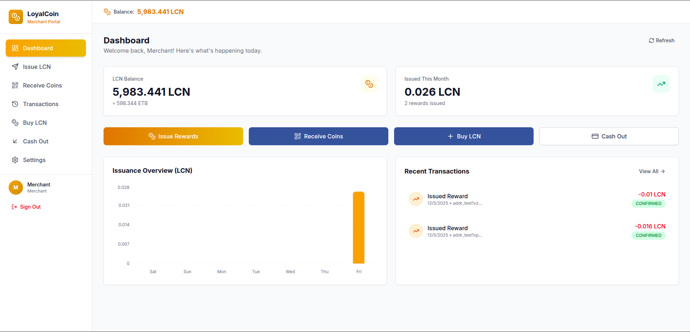
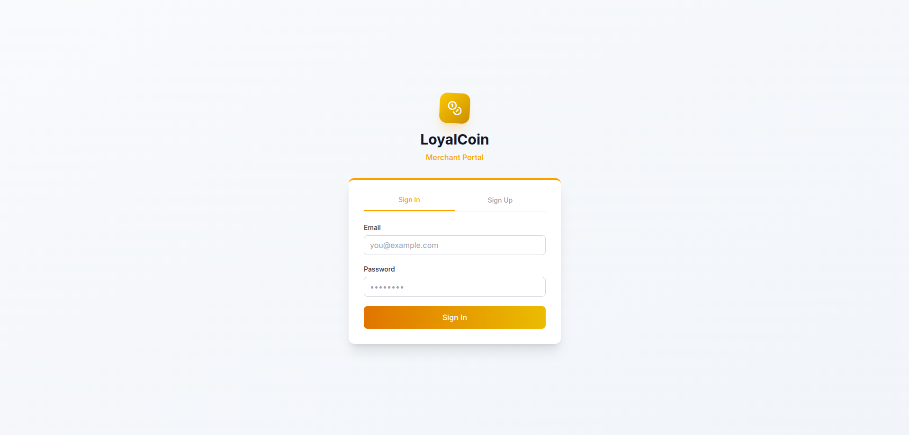
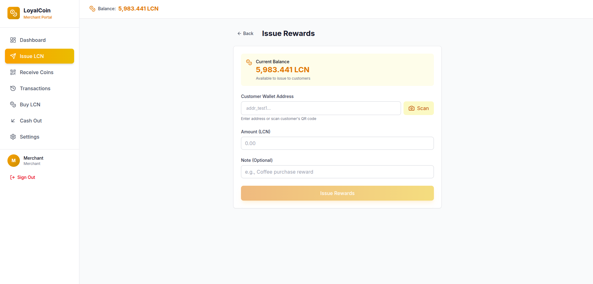
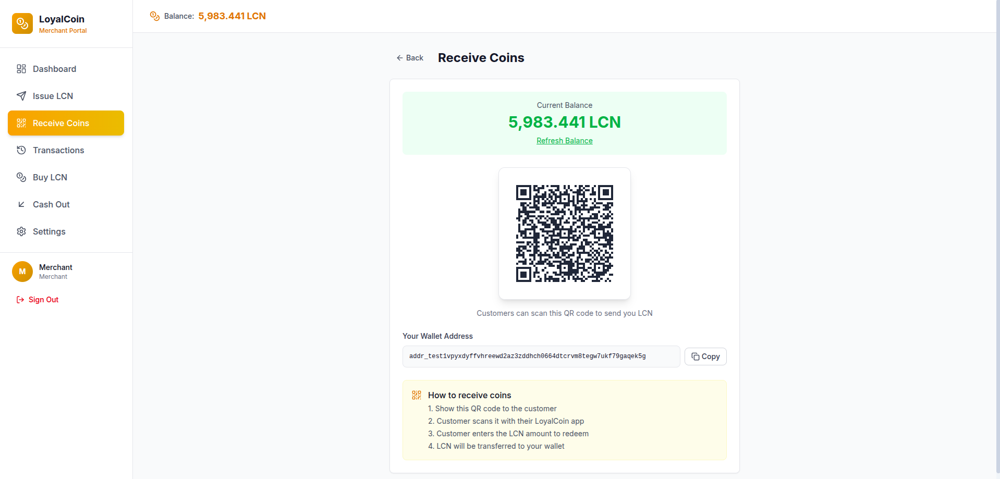
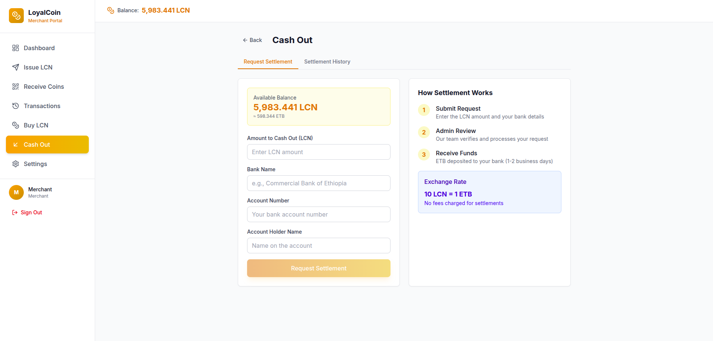
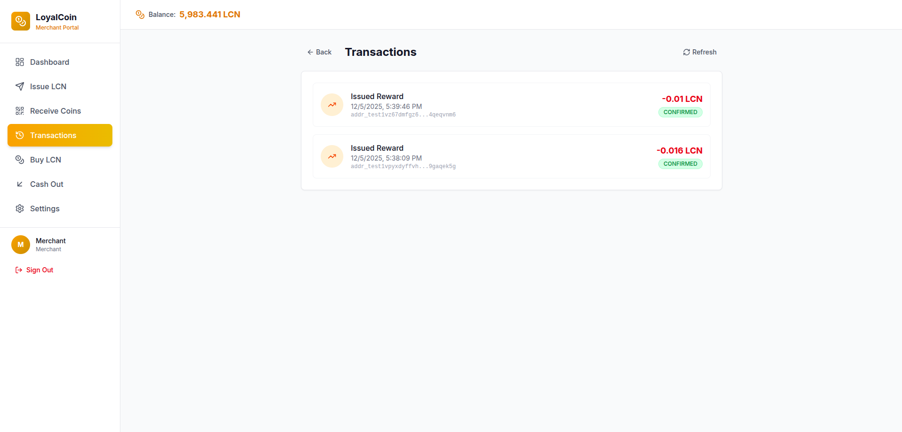
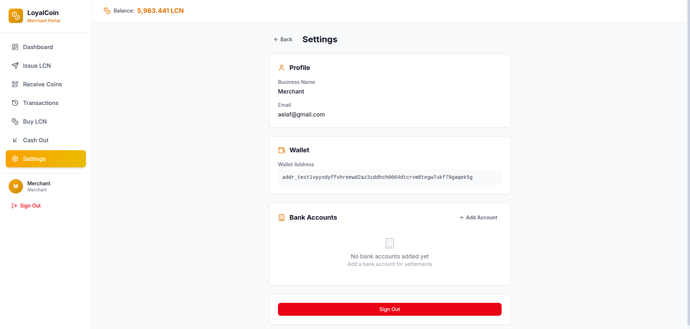

# LoyalCoin Merchant Portal

The **LoyalCoin Merchant Portal** is a merchant-facing web application that enables businesses to participate in the LoyalCoin rewards ecosystem. Merchants can issue rewards to customers, manage their LCN balance, purchase additional tokens, and convert LCN back to fiat currency—all through an intuitive, modern interface.

## Overview

Built on the Cardano blockchain, the LoyalCoin Merchant Portal provides businesses with a complete rewards management solution. Merchants can seamlessly issue digital loyalty rewards (LoyalCoin - LCN) to customers, track transactions in real-time, and manage their token inventory with enterprise-grade security and transparency.

**Key Benefits:**
- **Low Transaction Costs**: Leverage Cardano's efficient blockchain infrastructure
- **Instant Issuance**: Reward customers in real-time via QR code or wallet address
- **Flexible Cash Flow**: Purchase LCN tokens when needed, cash out when profitable
- **Full Transparency**: Track every transaction on the blockchain
- **Cross-Merchant Network**: Customers can redeem rewards across participating businesses

## Screenshots

### Dashboard Overview

*Real-time overview of your LCN balance, recent transactions, and quick actions*

### Authentication

*Secure authentication with automatic Cardano wallet creation*

### Issue Rewards

*Scan QR codes or paste wallet addresses to instantly reward customers*

### Receive Payments

*Accept LCN as payment by generating QR codes or sharing your wallet address*

### Buy LCN Tokens

*Request LCN token allocations with bank transfer or other payment methods*

### Cash Out

*Convert LCN back to Ethiopian Birr with automated settlement requests*

### Transaction History

*Complete audit trail of all LCN issuances, receipts, purchases, and settlements*

### Settings

*Manage business profile, bank accounts, and view wallet details*

## Tech Stack

- **Frontend Framework**: React 19 with TypeScript
- **Build Tool**: Vite 6
- **Routing**: React Router DOM v7 (HashRouter)
- **State Management**: Zustand 5 with persist middleware
- **Styling**: Custom CSS with modern design patterns
- **QR Code**: html5-qrcode for scanning, qrcode.react for generation
- **Charts**: Recharts for analytics and data visualization
- **Icons**: Lucide React

## Features

### 🔐 Authentication & Onboarding
- **Quick Signup**: Create merchant account with email and business name
- **Automatic Wallet Creation**: Cardano wallet generated automatically on signup
- **Persistent Sessions**: Secure token-based authentication with auto-refresh
- **Business Profiles**: Store business name and branding information


### 📊 Dashboard
- **Real-Time Balance**: View current LCN holdings with automatic updates
- **Quick Actions**: One-click access to issue, receive, buy, or cash out
- **Recent Transactions**: Latest activity summary with status indicators
- **Analytics Charts**: Visual insights into rewards issuance and transaction trends
- **System Status**: Connection health and wallet sync status


### 💎 Issue LCN (Reward Customers)
- **QR Code Scanning**: Use device camera to scan customer wallet QR codes
- **Manual Entry**: Paste customer wallet addresses directly
- **Amount Input**: Specify LCN amount with real-time ETB/ADA conversion
- **Transaction Notes**: Add references or descriptions for record-keeping
- **Instant Confirmation**: Blockchain transaction submitted immediately
- **Transaction Tracking**: Monitor status from pending to confirmed


### 📥 Receive LCN (Accept Payments)
- **QR Code Display**: Generate QR code of your merchant wallet address
- **Address Sharing**: Copy-paste wallet address for online transactions
- **Payment Detection**: Automatic notification when LCN is received
- **Transaction Verification**: View incoming payments with blockchain confirmations
- **Multi-Channel**: Accept payments via in-store scanning or remote transfers


### 💰 Buy LCN (Purchase Token Allocation)
- **Flexible Amounts**: Request any quantity of LCN tokens
- **Fiat Calculation**: Automatic ETB cost calculation (1 LCN = 1 ETB)
- **Payment Methods**: Support for bank transfer, mobile money, and more
- **Payment Proof**: Upload payment receipts (optional)
- **Admin Approval**: Request submitted for admin verification
- **Purchase History**: Track all allocation requests and their statuses


### 🏦 Cash Out (Settlement Request)
- **LCN to Fiat**: Convert LCN holdings back to Ethiopian Birr
- **Bank Account Management**: Save multiple bank accounts for settlements
- **Amount Selection**: Choose how much LCN to cash out
- **Exchange Rate**: Transparent 1 LCN = 1 ETB conversion
- **Admin Processing**: Settlement requests reviewed by admin for fraud prevention
- **Settlement History**: View all cash-out requests and payment statuses


### 📜 Transaction History
- **Complete Audit Trail**: Every LCN movement recorded on-chain
- **Transaction Types**: Issue, receive, allocation, settlement clearly labeled
- **Status Tracking**: Pending, confirmed, completed, failed states
- **Blockchain Links**: View transaction hashes on Cardano explorer
- **Filtering & Search**: Find specific transactions quickly
- **Pagination**: Handle large transaction histories efficiently


### ⚙️ Settings
- **Business Profile**: Update business name and contact information
- **Bank Accounts**: Add and manage withdrawal bank accounts
- **Wallet Details**: View Cardano wallet address and copy to clipboard
- **Account Security**: Password management (future feature)
- **Notification Preferences**: Email alerts for transactions (future feature)


## Economic Model

### LoyalCoin Conversion Rates
- **1 LCN = 1 ETB** (Ethiopian Birr)
- **1 LCN = 0.1 tADA** (Test ADA on PreProd network)
- **100 LCN = 1 tADA**
- **1 LCN = 10,000 lovelace** (atomic units)

### Transaction Fees
- **Issuance**: Negligible Cardano network fee (~0.17 ADA)
- **Receipt**: No merchant fees (customer pays network fee)
- **Allocation Purchase**: Admin may charge processing fees
- **Settlement**: Admin may charge withdrawal fees

## Prerequisites

- **Node.js**: v18 or higher
- **npm**: v9 or higher (comes with Node.js)
- **Modern Browser**: Chrome, Firefox, Safari, or Edge (latest version)
- **LoyalCoin Backend**: Running and accessible
- **Camera Access**: For QR code scanning (optional)

## Installation

### 1. Navigate to the Merchant Portal Directory

```bash
cd loyalcoin-merchant-portal
```

### 2. Install Dependencies

```bash
npm install
```

This will install all required packages including React, TypeScript, Vite, and QR code libraries.

### 3. Configure Environment Variables

Create a `.env.local` file in the root directory:

```env
VITE_API_URL=http://localhost:8080
```

**Configuration Options:**
- `VITE_API_URL`: Backend API base URL (default: `http://localhost:8080`)

### 4. Verify Installation

```bash
npm run dev
```

The application should start on `http://localhost:5173`

## Running the Application

### Development Mode

Start the development server with hot module replacement:

```bash
npm run dev
```

**Default URL**: `http://localhost:5173`

The app will automatically reload when you make changes to the code.

### Production Build

Build the optimized production bundle:

```bash
npm run build
```

The output will be in the `dist/` directory, ready for deployment.

### Preview Production Build

Test the production build locally before deployment:

```bash
npm run preview
```

## Project Structure

```
loyalcoin-merchant-portal/
├── components/               # Reusable UI components
│   ├── Layout.tsx           # Main layout with navigation sidebar
│   └── UIComponents.tsx     # Shared buttons, cards, modals
├── pages/                   # Route-based page components
│   ├── Login.tsx            # Login and signup page
│   ├── Dashboard.tsx        # Main dashboard view
│   ├── IssueLCN.tsx        # Issue rewards to customers
│   ├── Receive.tsx         # Receive LCN from customers
│   ├── BuyLCN.tsx          # Purchase LCN allocation
│   ├── CashOut.tsx         # Request settlement to bank
│   ├── Transactions.tsx    # Transaction history
│   └── Settings.tsx        # Account settings
├── services/               # Backend API integration
│   └── api.ts             # API client and type definitions
├── screenshots/           # Documentation images
├── App.tsx               # Main app with routing
├── store.ts              # Zustand global state
├── types.ts              # TypeScript type definitions
├── index.tsx             # Application entry point
├── index.html            # HTML template
├── vite.config.ts        # Vite build configuration
└── package.json          # Dependencies and scripts
```

## Usage Guide

### Getting Started

#### 1. Create Your Merchant Account

1. Navigate to `http://localhost:5173`
2. Click **"Sign Up"** on the login page
3. Enter your email, create a strong password, and provide your business name
4. Click **"Create Account"**
5. A Cardano wallet is automatically created for your business
6. You'll be logged in and redirected to the dashboard


#### 2. Fund Your LCN Balance

Before issuing rewards, you need to purchase LCN tokens:

1. Click **"Buy LCN"** from the dashboard or sidebar
2. Enter the amount of LCN you want to purchase (e.g., 1000 LCN = 1000 ETB)
3. Select payment method (Bank Transfer, Mobile Money, etc.)
4. Transfer the displayed ETB amount to the provided bank account
5. Enter your payment reference number
6. (Optional) Upload payment proof/receipt
7. Click **"Submit Request"**
8. Wait for admin approval (you'll receive LCN once approved)


### Issuing Rewards to Customers

#### Option 1: Scan Customer QR Code

1. Navigate to **"Issue LCN"** page
2. Click **"Scan QR Code"** button
3. Allow camera access when prompted
4. Point camera at customer's wallet QR code
5. Enter reward amount in LCN
6. (Optional) Add a note (e.g., "Purchase reward")
7. Click **"Issue LCN"**
8. Transaction is submitted to blockchain
9. Customer receives LCN within seconds

#### Option 2: Manual Wallet Address Entry

1. Navigate to **"Issue LCN"** page
2. Ask customer for their Cardano wallet address
3. Paste address in the **"Customer Wallet Address"** field
4. Enter reward amount in LCN
5. (Optional) Add transaction note
6. Click **"Issue LCN"**
7. Confirm transaction details
8. LCN is sent to customer's wallet


### Receiving LCN from Customers

Customers can pay you in LCN for goods or services:

1. Navigate to **"Receive"** page
2. Your merchant wallet address is displayed
3. **Option A**: Show QR code for in-person payments
   - Customer scans your QR code with their wallet app
   - Customer enters amount and sends LCN
4. **Option B**: Share wallet address for online payments
   - Click **"Copy Address"** button
   - Send address to customer via email/chat
   - Customer sends LCN to your address
5. Monitor incoming transactions on the dashboard
6. Transactions appear once confirmed on blockchain


### Cashing Out LCN to Bank

Convert your LCN holdings back to Ethiopian Birr:

1. Navigate to **"Cash Out"** page
2. If first time, add your bank account details:
   - Bank name
   - Account number
   - Account holder name
3. Select bank account for withdrawal
4. Enter LCN amount to cash out
5. Review ETB amount you'll receive (1 LCN = 1 ETB)
6. Click **"Request Settlement"**
7. Admin reviews your request
8. Once approved, ETB is transferred to your bank account
9. Track settlement status in the history table


### Viewing Transaction History

Track all your LCN activity:

1. Navigate to **"Transactions"** page
2. View complete list of all transactions:
   - **ISSUE**: LCN sent to customers (rewards)
   - **RECEIVE**: LCN received from customers (payments)
   - **ALLOCATION**: LCN purchased from admin
   - **SETTLEMENT**: LCN converted to bank deposits
3. Check transaction status:
   - **Pending**: Submitted to blockchain, awaiting confirmation
   - **Confirmed**: Verified by Cardano network
   - **Completed**: Fully processed
   - **Failed**: Transaction error (rare)
4. Click transaction hash to view on Cardano explorer
5. Use pagination to browse older transactions


### Managing Settings

#### Update Business Profile

1. Navigate to **"Settings"** page
2. View current business name
3. (Future) Click "Edit" to update business information

#### Manage Bank Accounts

1. Go to **"Settings"** → **"Bank Accounts"** section
2. Click **"Add Bank Account"**
3. Enter bank details:
   - Bank name (e.g., "Commercial Bank of Ethiopia")
   - Account number
   - Account holder name (must match registration)
4. Click **"Save"**
5. Account appears in cash-out page for settlements

#### View Wallet Information

1. In **"Settings"** → **"Wallet"** section
2. View your Cardano wallet address
3. Click **"Copy Address"** to copy to clipboard
4. Share this address to receive LCN from others


## API Integration

The merchant portal communicates with the LoyalCoin backend REST API.

### Authentication Endpoints

| Endpoint | Method | Purpose |
|----------|--------|---------|
| `/api/v1/auth/signup` | POST | Create new merchant account |
| `/api/v1/auth/login` | POST | Authenticate existing merchant |

### Wallet Endpoints

| Endpoint | Method | Purpose |
|----------|--------|---------|
| `/api/v1/wallet/balance` | GET | Get current LCN balance |
| `/api/v1/wallet/transactions` | GET | Fetch transaction history |

### LCN Operations

| Endpoint | Method | Purpose |
|----------|--------|---------|
| `/api/v1/lcn/issue` | POST | Issue LCN to customer address |

### Merchant Endpoints

| Endpoint | Method | Purpose |
|----------|--------|---------|
| `/api/v1/merchant/allocation/purchase` | POST | Request LCN purchase |
| `/api/v1/merchant/allocation/history` | GET | View allocation history |
| `/api/v1/merchant/settlement/request` | POST | Request cash-out to bank |
| `/api/v1/merchant/settlement/history` | GET | View settlement history |

**Authentication**: All endpoints (except login/signup) require a valid JWT token in the `Authorization: Bearer <token>` header.

## Configuration

### Environment Variables

| Variable | Description | Default | Required |
|----------|-------------|---------|----------|
| `VITE_API_URL` | Backend API base URL | `http://localhost:8080` | Yes |

### Port Configuration

The development server uses Vite's default port **5173**. To change it, update `vite.config.ts`:

```typescript
export default defineConfig({
  plugins: [react()],
  server: {
    port: 3000 // Your custom port
  }
})
```

### Hash Routing

The app uses `HashRouter` for Electron compatibility. URLs use hash-based routing:
- `http://localhost:5173/#/` - Dashboard
- `http://localhost:5173/#/issue` - Issue LCN
- `http://localhost:5173/#/transactions` - Transactions

## Security Best Practices

### For Merchants

- **Never Share Your Password**: Keep credentials secure and private
- **Verify Customer Addresses**: Double-check wallet addresses before issuing LCN
- **Monitor Transactions**: Regularly review transaction history for anomalies
- **Secure Your Device**: Use password protection and antivirus software
- **HTTPS in Production**: Always access the portal over encrypted connections

### For Developers

- **Environment Variables**: Never commit `.env.local` to version control
- **Token Storage**: JWT tokens stored in localStorage (rotate tokens regularly)
- **Input Validation**: All user inputs validated client and server-side
- **API Error Handling**: Graceful error messages without exposing internals
- **CORS Configuration**: Ensure backend allows only trusted origins in production

## Troubleshooting

### Cannot Login / Signup

**Symptoms**: Error messages during authentication

**Solutions**:
- Verify backend is running at the configured `VITE_API_URL`
- Check browser console for detailed error messages
- Ensure email format is valid
- Try clearing browser cache and localStorage
- Verify database connection in backend logs

### QR Code Scanner Not Working

**Symptoms**: Camera doesn't activate or QR code not detected

**Solutions**:
- Grant camera permissions in browser settings
- Use HTTPS or localhost (required for camera access)
- Try a different browser (Chrome recommended)
- Ensure QR code is clearly visible and well-lit
- Check if camera is being used by another application

### Balance Not Updating

**Symptoms**: LCN balance doesn't reflect recent transactions

**Solutions**:
- Refresh the page (balance fetched on load)
- Wait for blockchain confirmation (can take 20-60 seconds)
- Check transaction status in "Transactions" page
- Verify backend connection to Cardano node
- Review backend logs for blockchain sync issues

### Transaction Failed

**Symptoms**: Transaction shows "FAILED" status

**Solutions**:
- Check if you have sufficient LCN balance for issuance
- Verify wallet address is valid Cardano address
- Ensure backend has sufficient ADA for network fees
- Check backend logs for specific error details
- Contact admin if issue persists

### Cannot Cash Out

**Symptoms**: Settlement request fails or not processed

**Solutions**:
- Verify you have sufficient LCN balance
- Ensure bank account details are correct
- Check if there are minimum withdrawal amounts
- Wait for admin approval (can take hours to days)
- Contact system administrator for status update

## Development

### Code Organization

- **Components**: Reusable UI elements (buttons, cards, forms)
- **Pages**: Route-based components with business logic
- **Services**: API integration layer with type-safe interfaces
- **Store**: Global state management with Zustand
- **Types**: Shared TypeScript type definitions

### State Management

The application uses Zustand with the following state:

```typescript
{
  user: User | null;              // Authenticated merchant info
  token: string | null;           // JWT authentication token
  wallet: {
    balanceLCN: number;          // Current LCN balance
    transactions: Transaction[]; // Transaction history
    bankAccounts: BankAccount[]; // Saved bank accounts
  };
  isAuthenticated: boolean;      // Auth status
  isLoading: boolean;           // Loading indicator
  error: string | null;         // Error messages
}
```

State is persisted to localStorage automatically (excluding sensitive data).

### Adding New Features

1. **Define Types**: Add TypeScript interfaces in `types.ts`
2. **Create API Functions**: Add backend calls in `services/api.ts`
3. **Update Store**: Add actions/state in `store.ts` if needed
4. **Build UI**: Create page component in `pages/` directory
5. **Add Route**: Register route in `App.tsx`
6. **Add Navigation**: Update `Layout.tsx` sidebar if needed
7. **Test Thoroughly**: Verify with backend integration

### Code Style Guidelines

- Use functional components with React hooks
- Follow TypeScript strict mode conventions
- Handle all async operations with try-catch
- Provide user-friendly error messages
- Add comments for complex business logic
- Use semantic HTML and accessible UI patterns

## Deployment

### Production Build

```bash
npm run build
```

Output is in `dist/` directory.

### Deployment Options

1. **Static Hosting** (Recommended):
   - Vercel, Netlify, or GitHub Pages
   - Upload `dist/` contents
   - Configure environment variables in hosting platform

2. **Web Server**:
   - Nginx, Apache, or Caddy
   - Serve `dist/` directory
   - Configure HTTPS with valid SSL certificate

3. **CDN**:
   - Cloudflare, AWS CloudFront
   - Upload assets to CDN
   - Configure caching and HTTPS

### Environment Configuration

Set production environment variables:

```env
VITE_API_URL=https://api.loyalcoin.example.com
```

Ensure backend CORS allows your production domain.

## Roadmap

### Planned Features

- 🔔 **Push Notifications**: Real-time alerts for incoming LCN
- 📧 **Email Notifications**: Transaction receipts and confirmations
- 📊 **Advanced Analytics**: Revenue tracking, customer insights
- 👥 **Multi-User Support**: Staff accounts with role-based permissions
- 🎨 **Branding Customization**: Upload logo, custom colors
- 📱 **Mobile App**: Native iOS and Android applications
- 🔍 **Advanced Search**: Filter transactions by date, amount, type
- 💱 **Multi-Currency**: Support for USD, EUR fiat settlements
- 🤝 **Customer Directory**: Save frequent customer wallet addresses
- 📄 **Bulk Operations**: Issue rewards to multiple customers at once

## Related Projects

- **[LoyalCoin Backend](../backend)**: Go-based REST API and Cardano integration
- **[LoyalCoin Admin Portal](../loyalcoin-admin-portal)**: Admin dashboard for system management
- **LoyalCoin Customer Wallet**: Customer-facing mobile app (future)

## Support

### Getting Help

- **Backend Issues**: Check backend logs and API documentation
- **Frontend Errors**: Review browser console and network tab
- **Blockchain Issues**: Verify Cardano node sync status
- **Account Issues**: Contact system administrator

### Reporting Bugs

When reporting issues, include:
1. Steps to reproduce the problem
2. Expected vs actual behavior
3. Browser console error messages
4. Screenshot if applicable
5. Browser and OS version

## License

This project is part of the LoyalCoin ecosystem. See the main [LICENSE](../LICENSE) file for details.

---

**Built with ❤️ for merchants on Cardano**
